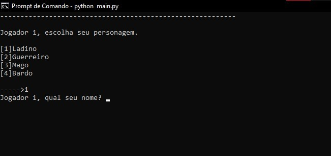

# Forest Fighting

**Forest Fighting** é um jogo de luta por turnos para dois jogadores, desenvolvido em Python, que utiliza conceitos de Programação Orientada a Objetos. No jogo, os jogadores se encontram na misteriosa Floresta dos Elfos Selvagens e devem usar suas habilidades e sorte para vencer o oponente.
Cada jogador pode escolher entre 4 classes de personagens: Ladino, Guerreiro, Mago ou Bardo, cada um com habilidades únicas. O Jogo é reproduzido em seu terminal console.

## Classes de Personagens

### Ladino
- **Atributo Principal**: Agilidade.
- **Armas**: Adaga, Arco Longo e Espada Longa.
- **Ataque Especial do persgonagem**: Ataque furtivo, causa mais dano no adversário.

### Guerreiro
- **Atributo Principal**: Força.
- **Armas**: Machado Quebrado, Lança e Machado de Batalha.
- **Ataque Especial do persgonagem**: Esta classe não possui ataque especial, porém começa o jogo com 20 a mais de vida do que as outras classes.

### Mago
- **Atributo Principal**: Inteligência.
- **Armas**: Faísca arcana, Raio de Eletricidade e Bola de fogo.
- **Ataque Especial do persgonagem**: Drenar vida, ele suga 10 de vida do oponente e cura 10 de vida de si próprio. 

### Bardo
- **Atributo Principal**: Sabedoria.
- **Armas**: Maracas, Viola e Bateria.
- **Ataque Especial do persgonagem**: Canção da vida, ele cura-se baseado em um valor randômico + o valor da sua sabedoria. 

## Mecânicas de Jogo

- **Escolha de Personagem**: Cada jogador escolhe seu personagem no início do jogo.
- **Ações de Turno**: Durante seu turno, o jogador pode atacar ou vasculhar a floresta em busca de itens que aumentem suas habilidades. Além disso, cada classe possui um ataque especial que pode ser utilizado apenas 1 vez durante a partida.
- **Barra de Vida**: Cada personagem possui uma barra de vida visualizada durante o jogo, que indica a saúde atual e máxima do personagem.
- **Itens**: Os jogadores podem encontrar talismãs na floresta que aumentam seus atributos (força, agilidade, inteligência e sabedoria), adicionando um elemento de sorte e estratégia ao jogo e equilibrando a jogabilidade dos players.
- **Tratativas de erros**: Caso um dos players escolha alguma opção não disponível para jogar, o jogo possui a trativa desse comando errado por parte do jogador. 

## Como Jogar

1. No início do jogo, cada jogador escolhe a classe de seu personagem: Ladino, Guerreiro, Mago ou Bardo.
2. Os jogadores vasculham a floresta para encontrar uma arma inicial.
3. O confronto começa, e os jogadores se alternam em turnos, podendo atacar o oponente, procurar por itens na floresta ou utilizar seu ataque especial.
4. O jogo continua até que a vida de um dos jogadores seja reduzida a zero.

## Tecnologias Utilizadas

- **Python**: Linguagem de programação utilizada para o desenvolvimento do jogo.
- **Programação Orientada a Objetos**: Estruturação do código com classes para personagens, armas, itens aleatórios e barras de vida.
- **Lib OS**: Para limpeza do console entre turnos dos jogadores.
- **Lib Time**: Aprimorar a experiência do jogador, com um timing durante as rodadas, deixando o jogo mais fluído. 
- **Lib Random**: Adicionar aleatoriade em escolhas de certos atributos durante o jogo.
- **Arquivo Lib.py**: Layout para aprimorar a experiência do jogador.

## Instalação e Execução

1. Clone este repositório.
2. Certifique-se de ter o Python instalado em sua máquina.
3. Execute o arquivo `Main.py` para iniciar o jogo em seu console ou seu cmd.

```bash
git clone https://github.com/GabrielMarotto/Forest-Fighting---Object-oriented-turn-based-RPG.git
cd Forest-Fighting---Object-oriented-turn-based-RPG
python Main.py
```

Divirta-se jogando **Forest Fighting** e desafie seus amigos para descobrir quem é o verdadeiro mestre da Floresta dos Elfos Selvagens!

---

## Funcionalidades

- Tela inicial do game: 
    <div aling='center'>
     
    </div> 


- Telas onde o player irá escolher a sua classe e o seu nome no jogo:
   <div aling='center'>
    
   </div> 


- Após as escolhas de classes e de nomes dos players, o game irá escolher aleatoriamente as armas inicias dos personagens:
   <div aling='center'>
    
   </div> 
   

- Após receberem as armas o player 1 inicia seu round, podendo escolher entre 3 opções, que serão atacar, vasculhar floresta e  utilizar ataque especial único:
   <div aling='center'>
    
   </div> 

- Player escolhendo a opção de Ataque:
   <div aling='center'>
    
   </div> 

- Player escolhendo a opção de vasculhar floresta, onde o player pode encontrar itens para melhorar seus atributos:
   <div aling='center'>
    
   </div> 
   

- Player escolhendo a opção de Ataque Especial de seu personagem e o próximo round dele sem essa opção disponível:
   <div aling='center'>
    
   </div> 

   <div aling='center'>
    
   </div> 

- Tela de Fim do Game após um player conseguir zerar a vida de seu adversário:
   <div aling='center'>
    
   </div> 


## Trativas de Erros

- Trativa caso o player escolha uma opção de classe inválida:
   <div aling='center'>
    
   </div>

- Trativa caso o player escolha uma opção durante o seu round inválida:
   <div aling='center'>
    
   </div>

## Créditos

 - Gabriel Marotto Alves
 - Wendel Santos